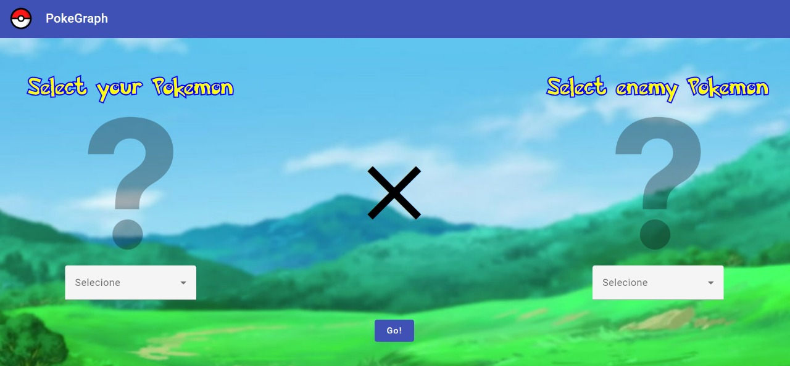
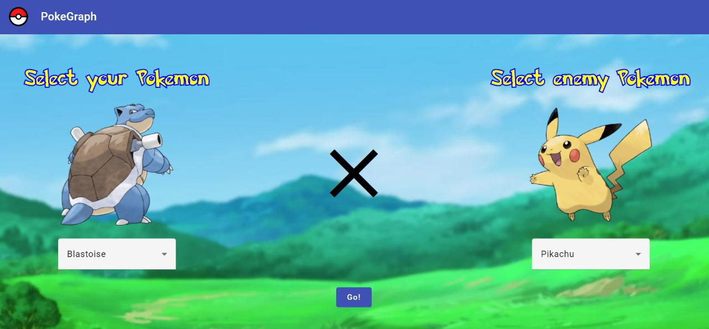
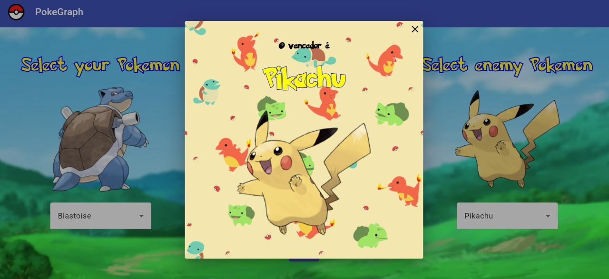

# PokeGraph

**Número da Lista**: Não se aplica<br>
**Conteúdo da Disciplina**: Grafos 1<br>

## Alunos
|Matrícula | Aluno |
| -- | -- |
| 19/0010606 | Artur de Sousa Vieira |
| 18/0145363 |  Yan Andrade de Sena  |

## Sobre 
O objetivo do Pokegraph é apresentar uma interface direta e simples de utilizar, que tem a função de mostrar o resultado
da batalha entre dois Pokemons, se baseando no tipo deles. Para isso é utilizado a estrutura de Grafos, que origina 
o nome do projeto:
Pokegraph!

## Screenshots

### Pagina inicial (Sem Seleção)

 

### Pagina inicial (Pokemons Selecionados)

 

### Modal de vitória

 

## Instalação 
**Linguagem**: Java, Typescript<br>
**Framework**: Springboot, Angular<br>

Para rodar o nosso projeto localmente, deverá ter instalado Java (versão 11), Node (versão 16) e Maven(Versão 3.8). Também sugerimos a instalação de uma IDE, o Intellij, já que o mesmo facilita rodar projetos Java.

Para rodar o backend (sem IDE) basta acessar o diretório pokegraph_backend e rodar o comando:

```
mvn spring-boot:run 
```

Para rodar o backend (com a IDE) instalada basta apertar o botão "▶" no método main da classe ``br.gov.incra.conflitoagrario.ConflitoAgrarioApplication``.

Para rodar o frontend basta ir no diretório pokegraph_frontend e rodar o comando:

```
npm i 
```

Para baixar as dependências e em seguida execute o comando:

```
npm run start
```

A aplicação estará disponível no endereço:

```
http://localhost:4200
```

## Uso 
Para a utilizaçao devemos selecionar dois pokémons e em seguida apertar o botão: ``"Go!"``.

## Outros 

### Link Repositório Antigo
Em vista de problemas na criação do git-hub na organização da disciplina,
segue o link para o [Repositório Antigo](https://github.com/yandrade1305/grafos1_pokegraph).

### Download Apresentação

Segue o Link para download da [Apresentação do projeto](assets-readme/apresentacao-pokegraph.mp4).<br>
(Para download, clique no link e depois nas opções *Download* ou *View Raw*)
